Thêm nút mới bằng @register_system_button để hệ thống tự quét và add nút vào web admin để chỉnh sửa 

# 🛍️ Telegram Shop Bot


A Telegram bot for selling **digital goods** (accounts, keys, licenses…): catalog and
stock, cart, multiple payment methods, a role-based admin panel (in‑chat **and** web),
and optional Redis caching.

[](https://www.python.org/downloads/)
[](https://docs.aiogram.dev/)
[](https://www.postgresql.org/)
[](https://www.docker.com/)
[](LICENSE)

> **Selling physical goods instead?** (inventory, shipping, delivery addresses) — use the
> [Telegram Physical Goods Shop](https://github.com/interlumpen/Telegram-shop-Physical).

## 🎬 Demo

<div align="center">
  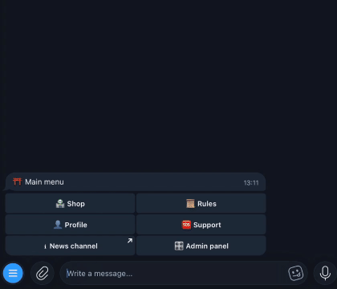
  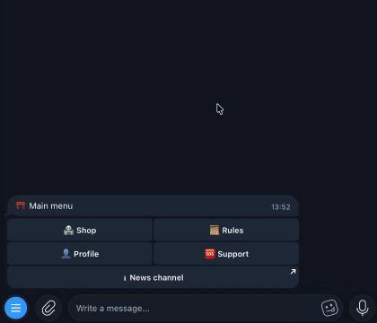
</div>

## 📋 Table of Contents

- [Features](#-features)
- [Security](#-security)
- [Tech Stack](#-tech-stack)
- [Architecture](#-architecture)
- [Configuration](#-configuration)
- [Installation](#-installation)
- [Admin panel](#-admin-panel)
- [Feature tour](#-feature-tour)
- [Testing](#-testing)

---

## ✨ Features

- **Catalog** — categories and products, per-unit stock that is either *limited* (one row
  per account/key, consumed on purchase) or *unlimited* (one value delivered every time),
  plus optional time‑limited per‑product sales.
- **Search** — find a product by name or description instead of paging categories; results
  are paginated and open the normal product page. Backed by trigram (GIN) indexes on
  PostgreSQL, with a graceful fallback when the `pg_trgm` extension isn't available.
- **Cart & promo codes** — add multiple items **with quantities**, apply a promo per item,
  atomic multi‑item checkout with a receipt. Promo types: `percent`, `fixed`, `balance`; with
  usage limits, expiry, and category/item binding. A promo stacks on top of an active sale;
  a `percent` promo scales per unit while a `fixed` one comes off the line once.
- **Restock notifications** — an out‑of‑stock product offers "notify me"; when stock arrives
  (from the bot **or** the web panel) everyone waiting is messaged once and unsubscribed.
- **Payments** — CryptoPay (crypto), Telegram Stars, and Telegram Payments (fiat). Balance
  top‑up model; purchases are paid from balance. Processing is idempotent and transactional.
- **Reviews** — 1–5★ ratings with optional text, one per user per item.
- **Referrals** — configurable commission on referred users' top‑ups.
- **Roles (RBAC)** — 10 granular permission bits, built‑in `USER`/`ADMIN`/`OWNER` plus custom
  roles. You can never grant a permission you don't hold yourself; the admin UI only shows
  buttons your role allows.
- **Admin** — an in‑chat admin menu and a **web panel** (SQLAdmin) with a built‑in help page,
  CSV export, and a full audit log. Broadcast messaging, user/balance management, catalog and
  promo management, statistics.
- **Performance** — fully async DB (`asyncpg` + async SQLAlchemy). **Optional** Redis caching
  and persistent FSM storage; the bot runs fine without Redis (in‑memory FSM, no caching).
- **Localization** — Russian and English.

## 🔒 Security

Implemented, and described honestly so you know what to rely on:

- **Payments & money** — server‑side amount validation before accepting a payment; idempotent
  processing (a `unique(provider, external_id)` constraint plus a `FOR UPDATE` lookup, so a
  retried/duplicate callback credits once); balance changes run under row locks (ACID); a
  circuit breaker pauses CryptoPay calls after repeated failures; self‑referral is blocked by
  DB `CHECK` constraints and a transaction guard. **Double‑spend on a purchase is prevented at
  the database layer** (row locks + stock removal + idempotent records), not by trusting the
  client.
- **Access control** — Telegram‑ID authentication; a 10‑bit permission bitmask with bitwise
  *subset* validation (you cannot create or assign a role exceeding your own); the role/permission
  cache is shared through Redis (when enabled) so a web‑panel edit invalidates it across every
  worker, falling back to a per‑process cache when Redis is off.
- **Rate limiting** — global and per‑action limits with temporary bans. When Redis is enabled the
  limiter state is shared across workers (sliding‑window sorted sets + TTL bans); without Redis it
  degrades to a per‑process in‑memory limiter. The web‑panel login limiter (5 attempts / 15 min per
  IP) and 30‑minute sessions remain per‑process.
- **Web panel** — constant‑time credential/secret comparison; proxy‑aware client IP (trusts
  `X‑Forwarded‑For` only when the socket peer is loopback, so an external client can't spoof it);
  remote login with the default `admin`/`admin` is blocked; every create/edit/delete is
  audit‑logged; financial tables are read‑only.
- **Input handling** — all database access is parameterized via the SQLAlchemy ORM (no raw
  SQL); user‑facing text is HTML‑escaped on render, and broadcast/category text is sanitized;
  search queries have their `LIKE` wildcards escaped, so typing `100%` searches for that
  literal rather than matching the whole catalog; CSV export neutralizes spreadsheet formula
  injection; item names are control‑character filtered.
- **Stale‑action guard** — taps on a transactional message older than 1 hour are rejected.

## 💻 Tech Stack

Python 3.11+ · aiogram 3 · PostgreSQL 16 (async SQLAlchemy 2.0 + `asyncpg`) · Alembic ·
Redis 7 *(optional)* · SQLAdmin + Starlette (web panel) · Pydantic · Docker.

## 🏗️ Architecture

<details>
<summary><b>System architecture</b> (click to expand)</summary>

Everything runs in **one process on one asyncio event loop**: the bot, the web
panel, and the background workers. There is no broker and no worker pool — the
"services" below are just long-lived tasks.

**How an update becomes a handler call**

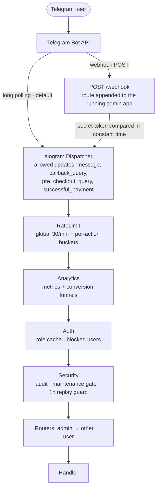

The middleware order is the order they are registered in
[`bot/main.py`](bot/main.py) — aiogram runs the first-registered outermost, so
rate limiting rejects a flood before anything else does work.

**What runs, and what it talks to**

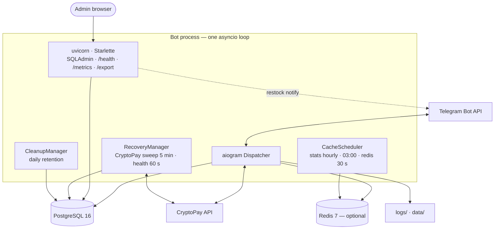

Worth knowing:

- **Webhook mode reuses the admin server.** `WEBHOOK_ENABLED=1` appends a
  `POST /webhook` route onto the *already running* Starlette app rather than
  starting a second one; the secret header is compared with `hmac.compare_digest`.
- **Redis is optional.** Without it: in-memory FSM, no caching, and a per-process
  rate limiter and role cache. With it, those are shared across workers.
- **The web panel is not read-only bookkeeping.** It runs in the same process as
  the bot, so an edit there clears the same caches and can message users — that
  is how a restock added in the panel reaches the people waiting for it.
- **Shutdown is graceful**: tasks stopped, metrics snapshot written to
  `data/final_metrics.json`, webhook removed, CryptoPay session and DB engine closed.

</details>

<details>
<summary><b>Database schema</b> (click to expand)</summary>

Two views of the same 15 tables: the product side and the people/money side.
Exact columns, indexes and `CHECK` constraints live in
[`bot/database/models/main.py`](bot/database/models/main.py) — the notes under the
diagrams say what each table is *for*.

**Catalog & stock**

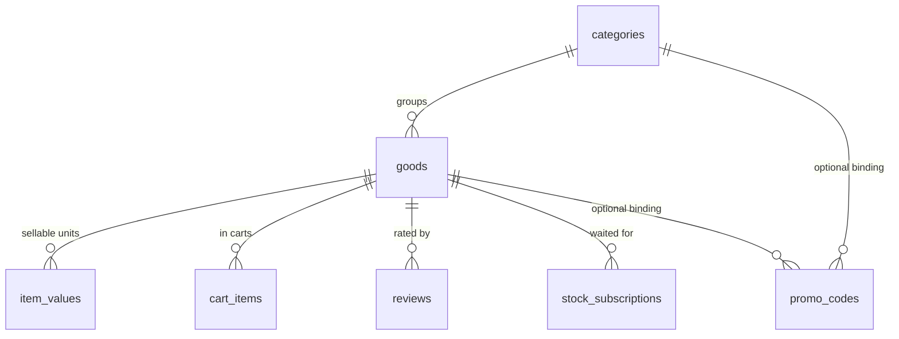

**Users, money & access**

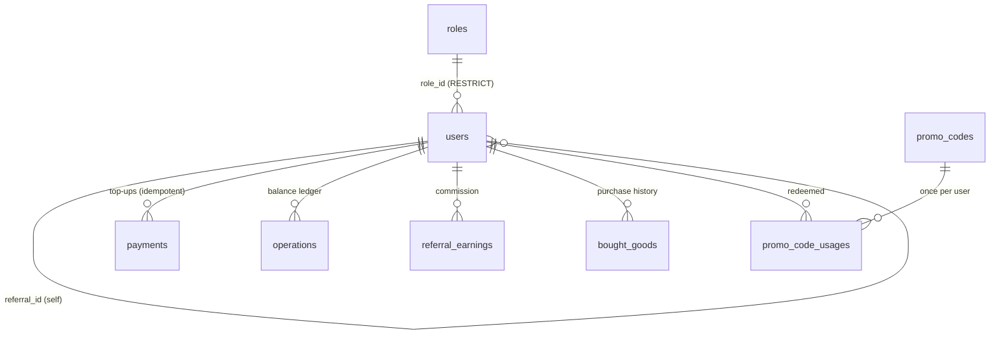

`audit_log` is absent from both on purpose: its `user_id` carries **no** foreign
key, so the trail outlives the user it refers to.

</details>

The data model, in plain terms:

- **users** — one row per Telegram user: balance, role, and (optionally) who referred them.
- **roles** — a name plus a permission **bitmask** (see the permission table under *Admin features*).
- **categories → goods (products) → item_values (stock)** — a product belongs to a category and
  its sellable units live in `item_values` (one row per account/key, or a single `is_infinity`
  row for unlimited delivery).
- **cart_items** / **reviews** — reference their product by foreign key, so a rename or delete
  never leaves them dangling. A cart holds one row per product with a `quantity` (unique per
  user+product, `CHECK (quantity > 0)`).
- **stock_subscriptions** — who is waiting for an out‑of‑stock product. Rows are *consumed*
  when the notification is sent, which is what stops a restock from messaging twice.
- **bought_goods** — purchase history, **one row per delivered unit** (each carries its own
  value, and its price is the per‑unit share of what was charged). It keeps the product *name*
  as a snapshot so history survives even if the product is later removed.
- **payments** — one row per top‑up, unique per `(provider, external_id)` so a duplicate/retried
  callback can only credit once. **operations** is the balance ledger (top‑ups, deductions,
  referral credits).
- **promo_codes** (+ per‑user usages) — a promo can be bound to a category or a product. It
  carries its own `scope` because the bindings are `ON DELETE SET NULL`. A promo whose target is gone
  stays scoped and applies to nothing.
- **referral_earnings**, and an **audit_log** of every admin action. All money is stored as
  exact `NUMERIC(12,2)` — never floats.

---

## ⚙️ Configuration

Copy `.env.example` to `.env` and fill it in. `TOKEN`, `OWNER_ID` and the `POSTGRES_*` values
are **required**; everything else has a sensible default.

<details>
<summary><b>Telegram &amp; payments</b></summary>

| Variable                    | Description                                                               | Default        |
|-----------------------------|---------------------------------------------------------------------------|----------------|
| `TOKEN`                     | Bot token from [@BotFather](https://telegram.me/BotFather)                | **required**   |
| `OWNER_ID`                  | Your [Telegram ID](https://telegram.me/myidbot) — becomes the first OWNER | **required**   |
| `TELEGRAM_PROVIDER_TOKEN`   | Token for Telegram Payments (fiat)                                        | –              |
| `CRYPTO_PAY_TOKEN`          | CryptoPay API token                                                       | –              |
| `STARS_PER_VALUE`           | Telegram Stars exchange rate (`0` disables Stars)                         | `0.91`         |
| `PAY_CURRENCY`              | Display currency (RUB, USD, EUR…)                                         | `RUB`          |
| `REFERRAL_PERCENT`          | Referral commission % (0–99)                                              | `0`            |
| `PAYMENT_TIME`              | Invoice validity, seconds                                                 | `1800`         |
| `MIN_AMOUNT` / `MAX_AMOUNT` | Allowed top‑up range                                                      | `20` / `10000` |

</details>

<details>
<summary><b>Links, locale &amp; logging</b></summary>

| Variable                                  | Description                                                   | Default                           |
|-------------------------------------------|---------------------------------------------------------------|-----------------------------------|
| `CHANNEL_URL` / `CHANNEL_ID`              | Optional news channel (new‑product posts, subscription check) | –                                 |
| `HELPER_ID`                               | Support user Telegram ID                                      | –                                 |
| `RULES`                                   | Rules text shown in the bot                                   | –                                 |
| `BOT_LOCALE`                              | Fallback UI locale: `vi`, `en`, or `ru`; each user can choose in the bot | `vi` |
| `BOT_LOGFILE` / `BOT_AUDITFILE`           | Log file paths                                                | `logs/bot.log` / `logs/audit.log` |
| `LOG_TO_STDOUT` / `LOG_TO_FILE` / `DEBUG` | `1`/`0` toggles                                               | `1` / `1` / `0`                   |
| `REVIEWS_ENABLED`                         | Enable product reviews (`1`/`0`)                              | `1`                               |

</details>

<details>
<summary><b>Web admin panel</b></summary>

| Variable                            | Description         | Default                   |
|-------------------------------------|---------------------|---------------------------|
| `ADMIN_HOST` / `ADMIN_PORT`         | Bind address / port | `localhost` / `9090`      |
| `ADMIN_USERNAME` / `ADMIN_PASSWORD` | Panel login         | `admin` / `admin`         |
| `SECRET_KEY`                        | Session signing key | `change-me-in-production` |

Change `ADMIN_PASSWORD` and `SECRET_KEY` before exposing the panel. In Docker the panel is
published on `127.0.0.1:9090` only.
</details>

<details>
<summary><b>Database, Redis, webhook, cleanup</b></summary>

| Variable                                                              | Description                                                     | Default                                  |
|-----------------------------------------------------------------------|-----------------------------------------------------------------|------------------------------------------|
| `POSTGRES_DB` / `POSTGRES_USER` / `POSTGRES_PASSWORD`                 | Database credentials                                            | **required**                             |
| `POSTGRES_HOST` / `DB_PORT`                                           | Host / port                                                     | `localhost` (or `db` in Docker) / `5432` |
| `REDIS_ENABLED`                                                       | `1` = Redis caching + persistent FSM; `0` = in‑memory, no cache | `1`                                      |
| `REDIS_HOST` / `REDIS_PORT` / `REDIS_DB` / `REDIS_PASSWORD`           | Redis connection                                                | `localhost` / `6379` / `0` / –           |
| `WEBHOOK_ENABLED` / `WEBHOOK_URL` / `WEBHOOK_PATH` / `WEBHOOK_SECRET` | Webhook mode (default: long polling)                            | `0` / – / `/webhook` / –                 |
| `AUDIT_RETENTION_DAYS` / `PAYMENTS_RETENTION_DAYS`                    | Auto‑cleanup age (`0` disables)                                 | `90` / `90`                              |

</details>

---

## 📦 Installation

### Docker (recommended)

```bash
git clone https://github.com/interlumpen/Telegram-shop.git
cd Telegram-shop
cp .env.example .env      # then edit .env

# with Redis (caching enabled):
docker compose --profile redis up -d --build
# without Redis: set REDIS_ENABLED=0 in .env, then:
docker compose up -d --build
```

The container applies migrations (`alembic upgrade head`), seeds roles, starts the bot, and
launches the admin panel at http://localhost:9090/admin. Logs: `docker compose logs -f bot`.

> On Linux, if `./logs` or `./data` hit permission errors, set `PUID`/`PGID` in `.env` to your
> host user (`id` shows them).

### Manual

```bash
python3.11 -m venv venv && source venv/bin/activate   # Windows: venv\Scripts\activate
pip install -r requirements.txt
cp .env.example .env      # then edit .env
alembic upgrade head       # required — the app does not create the schema itself
python run.py
```

**Verify:** send `/start` to the bot (the `OWNER_ID` user gets the OWNER role), and open
http://localhost:9090/admin.

---

## 🎛️ Admin panel

Two ways to manage the shop:

- **In‑chat menu** — open it from the bot; buttons are shown according to your permissions.
  Best for quick catalog and role edits (permissions are click‑to‑toggle there).
- **Web panel** (SQLAdmin, `/admin`) — browse/search/edit every table. The landing page is a
  **built‑in cheat sheet** explaining the product→stock workflow and the permission bitmask.

**Selling goods:** a *Product* is the listing; its sellable units are separate *Stock Items*
(one per account/key, or a single `is_infinity` unit for unlimited delivery). Renaming or
deleting a product keeps carts, reviews, and purchase history consistent automatically.

#### Adding stock from the web panel

Creating a *Stock Item* in the panel is a first-class way to restock: it clears the product's
cached stock count and notifies everyone waiting on that product, exactly as the in‑chat flow does.

### Monitoring endpoints

- `/health` — liveness probe. Public callers get only `{"status": "healthy"}` / 503
  (503 when the DB is down); the full component breakdown (Redis, uptime) is returned only
  to an authenticated session.
- `/metrics`, `/metrics/prometheus` — metrics (auth required).
- `/export/{users,purchases,operations,payments}` — CSV export with optional date filtering.

### Reliability

Background workers recover stuck CryptoPay payments (checked every 5 min, verified against the
API, idempotent), run periodic health checks, and clean up old audit logs / pending payments.
Shutdown is graceful (tasks cancelled, metrics snapshot saved, connections closed).

---

## 📱 Feature tour

<details>
<summary><b>👤 User features</b> (click to expand)</summary>

#### Main menu

The bot's home screen. Admins additionally see an **Admin panel** button here.

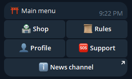
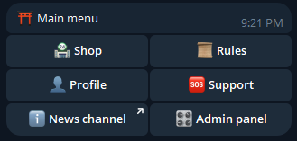

#### Browsing the shop

Shop → **categories** → **products** in a category. Out‑of‑stock products are still listed but
can't be bought.

The shop menu also offers **🔍 Search**: type a name or a keyword and get matching products
straight away — matches are looked for in both the product name and its description, so you
don't have to remember which category something lives in.

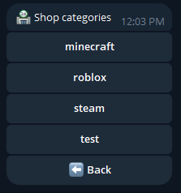
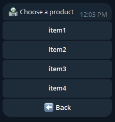

#### Product page & purchase

Each product shows its price (with any active sale/promo already applied), how many units are
left (or ∞), and its review rating. Buying pays from your **balance** and the stock value
(account/key/…) is delivered instantly in chat.

If a product is sold out, the page offers **🔔 Notify me when in stock** instead of a dead end:
you get a single message as soon as it's restocked, and the subscription is dropped.

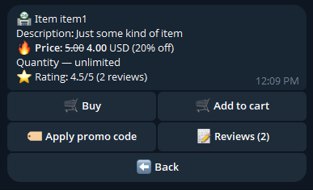
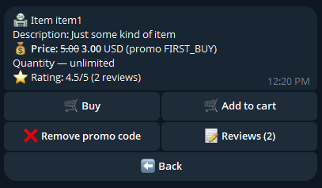

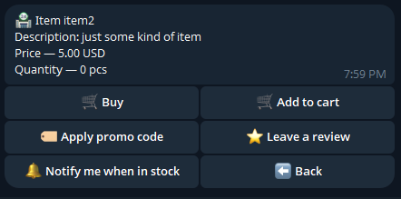
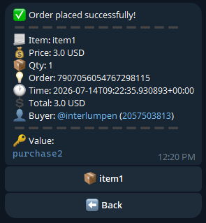

#### Profile & balance top‑up

The shop uses a **balance model**: you top up once (CryptoPay, Telegram Stars, or fiat via
Telegram Payments) and then spend from balance. The invoice is valid for `PAYMENT_TIME` seconds.

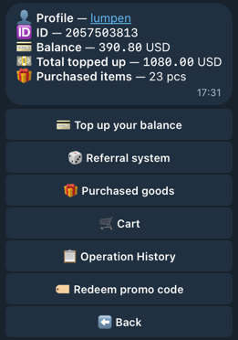
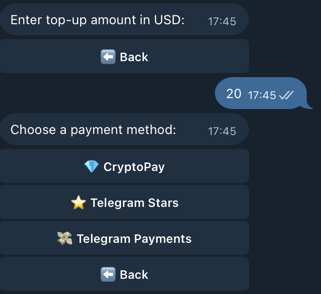

#### Cart

Add several products, set **how many** of each with the ➖/➕ stepper, attach a promo code
**per item**, then check out in one atomic transaction with a formatted receipt. Every unit
gets its own delivered value, so buying 3 keys hands you 3 different keys.

If the promo stops applying between adding and checkout — it expired, ran out, or its category was deleted — the line
says so and shows the real price, and the checkout aborts rather than silently charging full price.

The same goes for stock: if fewer units are left than you asked for, the checkout is refused
and nothing is charged (a product that has sold out entirely is simply dropped from the cart
and the rest goes through).

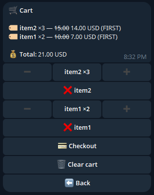

#### Referral system

Share your personal link (it carries your Telegram ID as the `/start` payload). When someone
who joined through it tops up, you earn `REFERRAL_PERCENT`% of that top‑up. Self‑referral is
blocked.

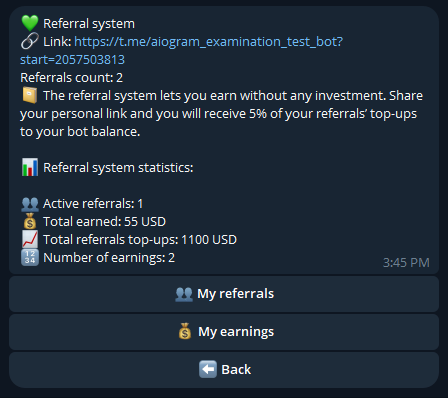

#### Purchases & operation history

**Purchases** lists everything you've bought (you can re‑view the delivered value).
**Operation history** is your money ledger — top‑ups, purchases, and referral credits.

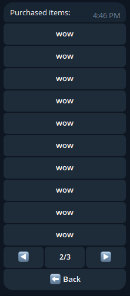
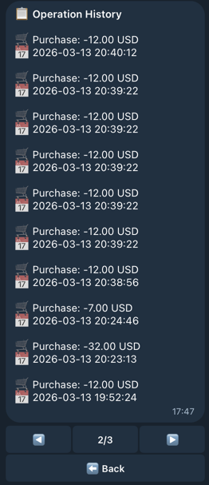

</details>

<details>
<summary><b>🎛️ Admin features</b> (click to expand)</summary>

Every button below is gated by your permissions — you only see what your role allows.

#### Admin menu & shop management

The hub for admins. From here: statistics, user management, catalog management, and
bought‑item search (find a purchase by its unique ID for support).

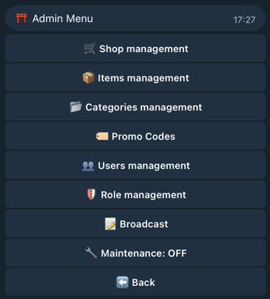
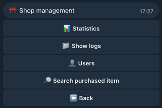

#### Categories & products

Create/edit/delete categories and products. When adding stock you choose **limited** (paste one
value per unit — each is consumed on purchase) or **unlimited** (one `is_infinity` value
delivered on every purchase). You can also set a **time‑limited sale** (a % off with an expiry);
the sale price is computed server‑side and a promo code stacks on top of it.

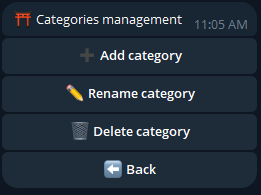
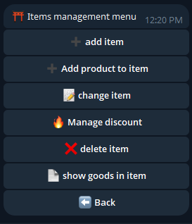

#### Stock, notifications & channel posting

When you add stock, two things happen automatically:

- **Waiting users are notified.** Anyone subscribed to that product gets a single "back in
  stock" message and is unsubscribed. This fires whether the stock was added from the in‑chat
  menu **or** from the web panel.
- **The news channel can be posted to** (`CHANNEL_ID`), announcing the product and how many
  units were added. This one is in‑chat only.

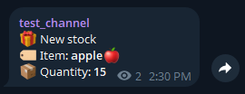
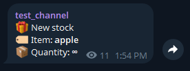

#### User management

Open a user to view their profile, adjust balance (top‑up/deduct — a **separate** `BALANCE`
permission), block/unblock, assign a role, and browse their referrals and purchases.

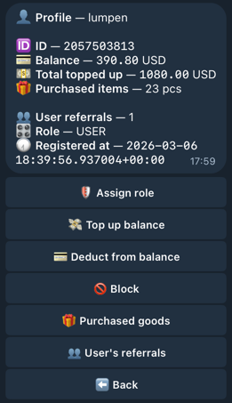

#### Roles & permissions

Create custom roles by toggling permission **bits** (the bot's role menu is click‑to‑toggle).
Two rules keep this safe: you can never grant a permission you don't hold yourself, and the
built‑in `USER`/`ADMIN`/`OWNER` roles can't be deleted.

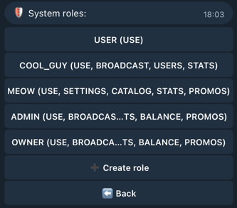
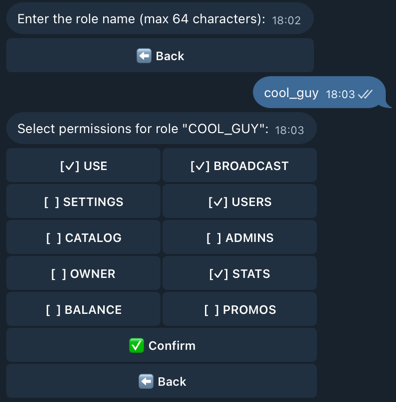

| Permission  | Value | Grants                                   |
|-------------|-------|------------------------------------------|
| `USE`       | 1     | Basic bot access                         |
| `BROADCAST` | 2     | Mass messaging                           |
| `SETTINGS`  | 4     | Maintenance mode                         |
| `USERS`     | 8     | View / block users, referrals, purchases |
| `CATALOG`   | 16    | Categories, products, stock              |
| `ADMINS`    | 32    | Create roles, assign roles               |
| `OWNER`     | 64    | Owner‑only operations                    |
| `STATS`     | 128   | Statistics, logs, item search            |
| `BALANCE`   | 256   | Top‑up / deduct balance                  |
| `PROMO`     | 512   | Promo‑code management                    |

A role's permissions is the **sum** of the values it grants (e.g. USE + CATALOG + STATS =
1 + 16 + 128 = `145`).

#### Broadcast, statistics & monitoring

Send a message to all users with a live progress counter; view shop statistics; read recent
logs. **Maintenance mode** (the `SETTINGS` permission) temporarily blocks regular users while
admins keep working.

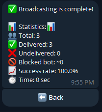
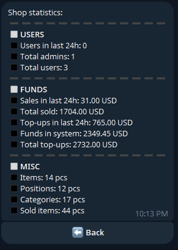
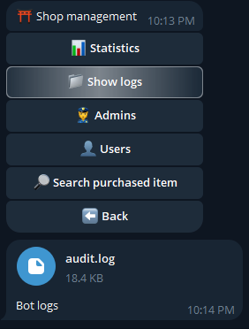

### SQLAdmin

You can do all the same things in SQLAdmin! Edits made there are not second‑class: they clear
the caches they affect (user, role, product, stock) and adding stock notifies the users waiting
for it, just like the in‑chat flow.

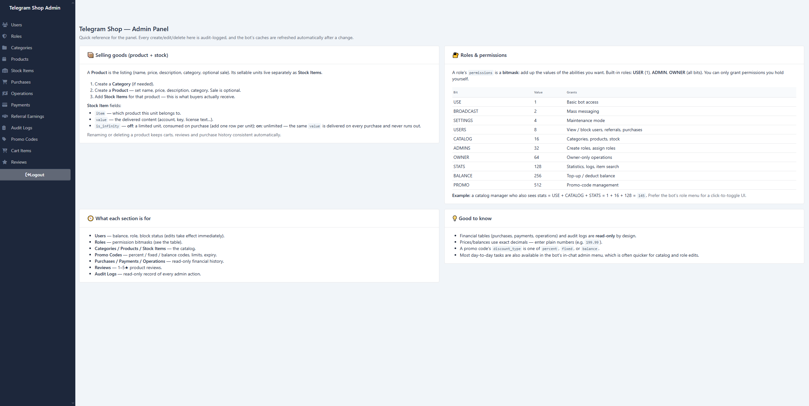

</details>

---

## 🧪 Testing

**648 tests** (`pytest`). The data layer runs against a real in‑memory async SQLite database
(real SQL, transactions, and constraints) — only external services are mocked (Telegram Bot
API, CryptoPay, Redis). What's covered:

- **Transactions & money** — purchase and cart‑checkout atomicity (balance deducted, stock
  removed, rollback on error), quantity checkout (one row per unit, partial stock aborts
  without charging, per‑unit prices summing back to the charge), promo semantics at quantity,
  payment **idempotency**, atomic admin balance changes, referral bonus calculation.
- **Promo codes & sales** — every validation path (buy, cart checkout, balance redeem,
  read‑only validate), scope enforcement (a promo whose bound category/product was deleted
  applies to nothing), what the cart displays matching what checkout charges, sale pricing,
  and promo‑on‑sale stacking.
- **CRUD** — users, roles (incl. custom create/edit/delete), categories, products, stock, cart
  (quantities, per‑user uniqueness), stock subscriptions, reviews, payments, operations;
  duplicate/blocking handling; stats queries.
- **Security & middleware** — rate limiting and bans (including that every mapped action has a
  limit), permission‑bitmask helpers, critical / replay‑action detection, authentication, the
  web‑panel login limiter, and role‑cache behavior.
- **Handlers** — user flows (`/start`, profile, shop, search, cart, referrals) and admin flows
  (user/role/balance management, catalog, paginated lists, profile views).
- **Infrastructure** — broadcast, restock notifications, payment recovery, metrics, caching &
  invalidation (including web‑panel edits), pagination, i18n, validators, and audit logging.

```bash
pytest                     # full suite (coverage runs automatically)
```
